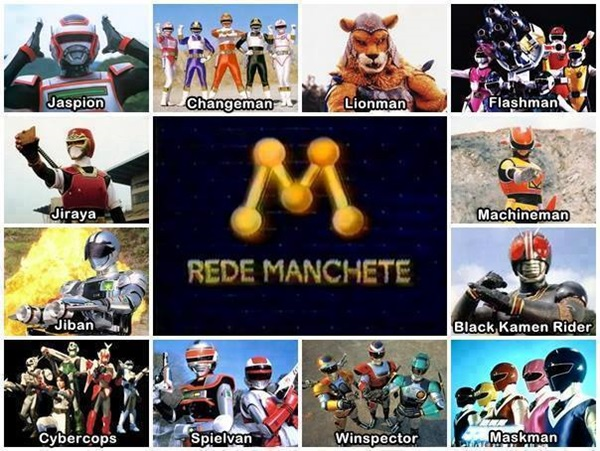

# Jovem Ninja



Site sobre cultura japonesa — Mangá, Anime, Tokusatsu e Games. Feito por quem cresceu com esses assuntos e nunca parou de acompanhar.

---

## Sobre o projeto

O Jovem Ninja nasceu da vontade de reunir em um lugar só os assuntos que marcaram uma geração: quadrinhos japoneses lidos de trás para frente, animações que passavam na madrugada, heróis mascarados que apareciam nos fins de semana e jogos que ensinavam mais do que qualquer sala de aula.

Não é um portal de notícias. É um espaço pessoal, feito com cuidado, para falar de cultura japonesa com a seriedade e o carinho que esses assuntos merecem.

---

## Páginas

| Página | Conteúdo |
|--------|----------|
| **Home** | Apresentação com imagem dos seriados clássicos da TV Manchete |
| **Mangá** | Catálogo de títulos, vídeo da Rede Manchete e mangás em destaque (Yuu Yuu Hakusho, Black Clover) |
| **Anime** | Imagens e link para download da Revista Herói 001 |
| **Tokusatsu** | Heróis mascarados, Super Sentai, Kamen Rider e clássicos do gênero |
| **Game** | Wallpaper e conteúdo sobre games atuais e do passado |
| **Contato** | E-mail de contato e links para redes sociais |

---

## Rodando o projeto

Nenhuma dependência. Basta abrir o arquivo no navegador:

```
index.html
```

Ou servir localmente com qualquer servidor estático:

```bash
npx serve .
```

---

## Arquivos do projeto

```
JovemNinja/
├── index.html                              # Página inicial
├── manga.html                              # Página de Mangá (com vídeo)
├── anime.html                              # Página de Anime (com PDF)
├── tokusatsu.html                          # Página de Tokusatsu
├── game.html                               # Página de Game
├── contato.html                            # Contato e redes sociais
├── style.css                               # Folha de estilos global
├── favicon.ico                             # Ícone do site
│
├── seriados.jpg                            # Imagem da home — seriados TV Manchete
├── manga.jpg                               # Capa da seção de mangás
├── animes.jpg                              # Imagem da seção de animes
├── tokusatsu.jpg                           # Imagem da seção de tokusatsu
├── games-of-2013-wallpaper-by-sakis25.jpg  # Wallpaper da seção de games
├── yuyu hakusho.jpg                        # Mangá Yuu Yuu Hakusho
├── black cover.jpg                         # Mangá Black Clover
│
├── email.jpg                               # Ícone de e-mail (contato)
├── facebook.jpg                            # Ícone Facebook
├── twitter.jpg                             # Ícone Twitter
├── instagram.jpg                           # Ícone Instagram
├── skype.jpg                               # Ícone Skype
├── linkedin.jpg                            # Ícone LinkedIn
├── youtube.jpg                             # Ícone YouTube
├── whatsapp.jpg                            # Ícone WhatsApp
│
├── rede manchete.mp4                       # Vídeo da Rede Manchete (em manga.html)
└── Revista Herói 001.pdf                   # Revista para download (em anime.html)
```

---

## Stack

- **HTML5** — estrutura semântica com roles de acessibilidade
- **CSS3** — layout responsivo com media queries
- Sem dependências externas — abre direto no navegador

---

**Desenvolvido por Leandro Ninja**
